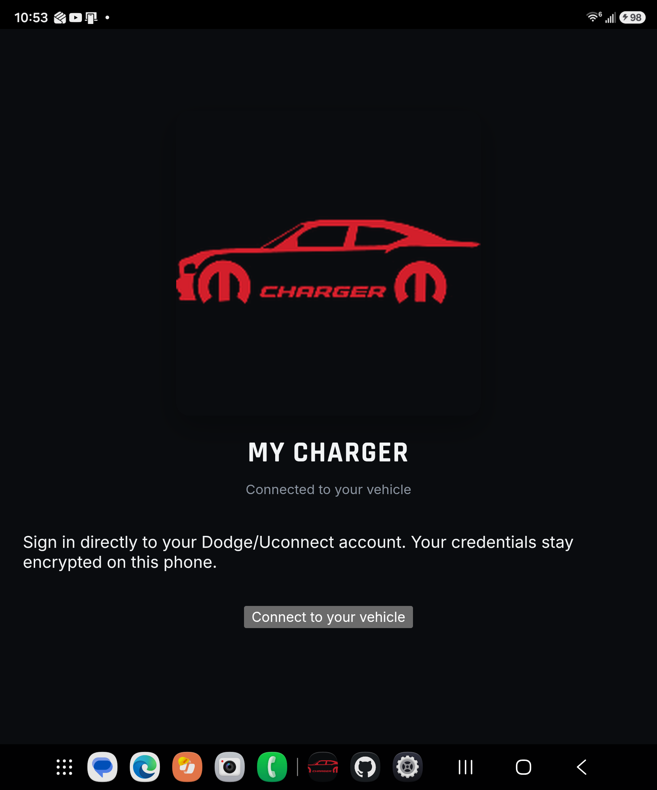
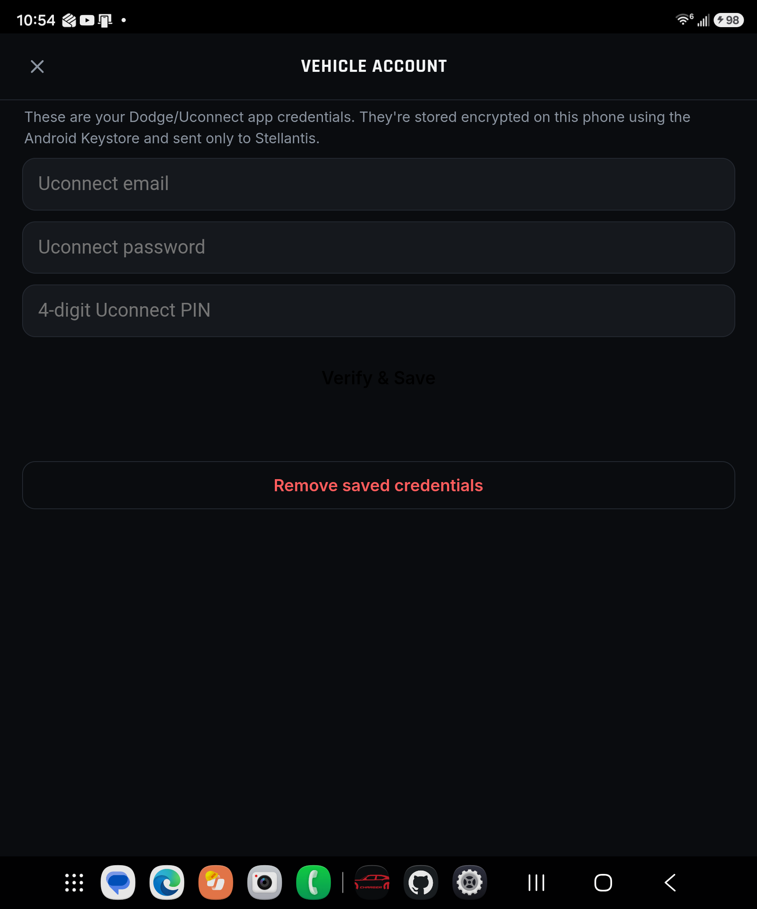
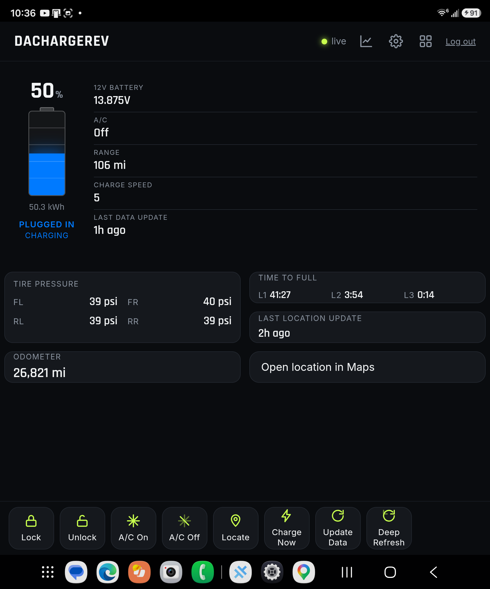
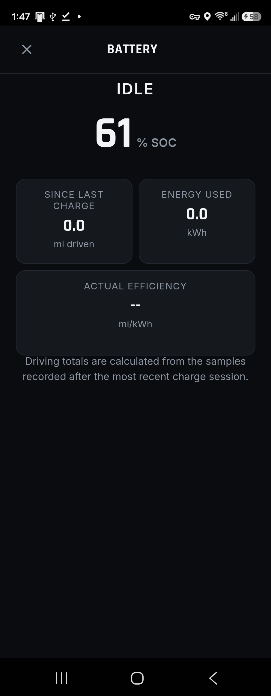
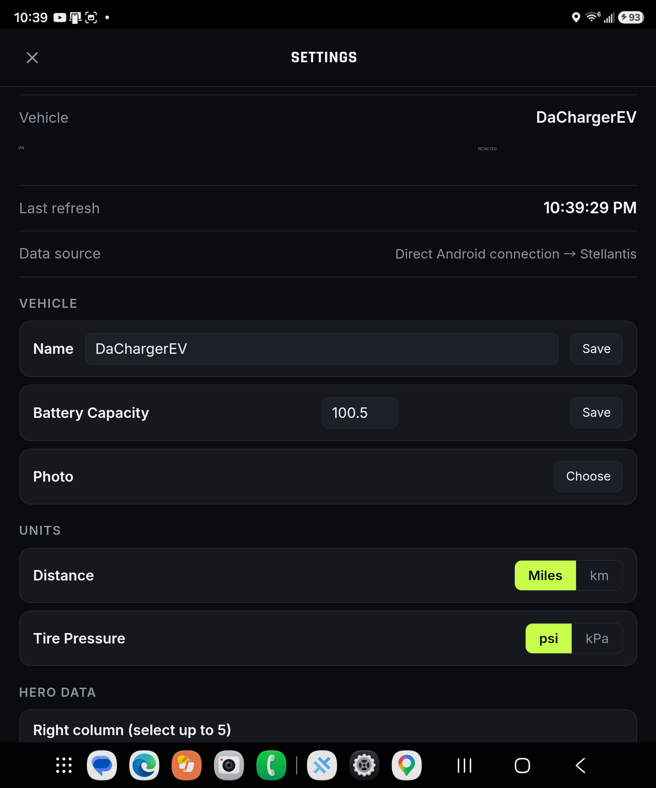
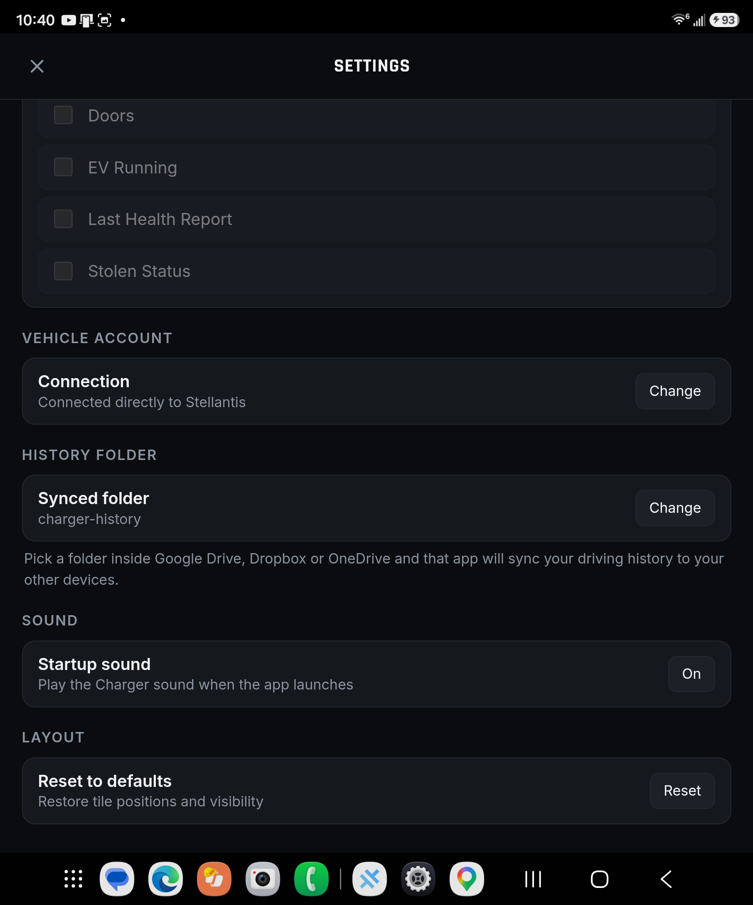
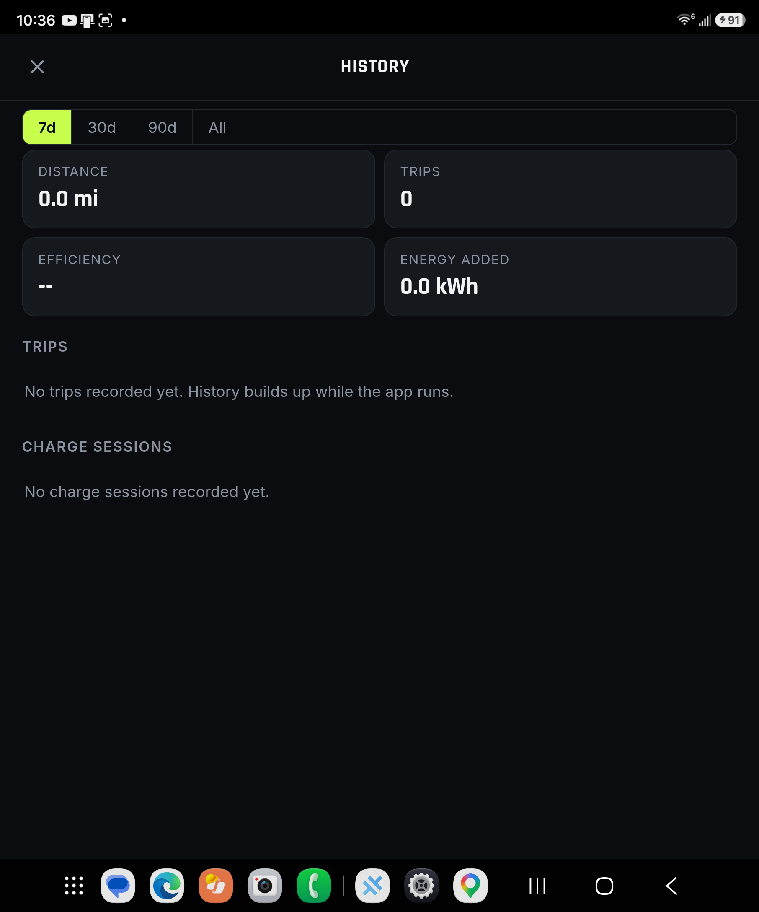

# My Charger for Android

My Charger is an Android-only Capacitor app for Dodge/Stellantis Uconnect vehicles. It shows vehicle
status, supports remote commands, records driving samples, and derives trip and charging history.

```
Android app (Capacitor + native plugins) ────> Stellantis API
                         └── synced folder ──> Drive / Dropbox / OneDrive
```

There is no Cloudflare account, Worker, Pages deployment, browser login, or web proxy. Native
Android HTTP is required because most Stellantis auth endpoints do not send CORS headers.

## Download

Download the latest beta APK directly from this repository:

[**My-Charger-beta.apk**](downloads/My-Charger-beta.apk)

On an Android phone, download the APK, allow installation from the browser or file manager when
prompted, and install it. The package is `dev.charger.app` and the launcher label is **My Charger**.
This is a signed beta release for direct Android distribution. It is not signed for Google Play
distribution, so Android may require enabling **Install unknown apps** for the browser or file
manager used to open it.

## Screenshots

### Connect screen



The first screen introduces My Charger and provides the entry point for connecting a Uconnect
vehicle.

### Initial setup



The initial setup screen explains Android Keystore protection and collects the Uconnect email,
password, and PIN before verification.

### Dashboard



The dashboard shows battery state, range, charge status, tire pressure, odometer, location, and
remote vehicle commands.

### Battery details



Tap the battery gauge to see the current Charging/Idle state, SOC, miles driven since the last
charge, energy used, and actual efficiency in mi/kWh.

### Settings



Settings includes vehicle naming, battery capacity, units, account connection, synced history folder,
startup sound, and dashboard layout controls.



The lower Settings section shows the direct Stellantis connection, the synced history folder for
Google Drive/Dropbox/OneDrive, the startup-sound toggle, and layout reset controls.

### Driving history



History summarizes distance, trips, efficiency, energy added, and charge sessions over selectable
time ranges.

## Build

Requirements:

- Node.js 20+
- Android Studio with Android SDK and a JDK supported by the installed Capacitor version

Install dependencies and generate/sync the Android project:

```bash
npm install
npx cap add android
npm run sync
npm run android:open
```

Build a beta release APK:

```bash
npm run android:beta
```

The custom plugins are in `android-app/app/src/main/java/dev/charger/app/`:

- `SecureStorePlugin` stores Uconnect credentials with `EncryptedSharedPreferences` backed by the
  Android Keystore.
- `SyncedFolderPlugin` uses the Storage Access Framework, persists folder permission across reboots,
  and reads/appends history files.

If `npx cap add android` creates a generated `android/` project, copy the custom Java plugin files
into the generated app module before syncing. Add these dependencies to
`android/app/build.gradle`:

```groovy
implementation "androidx.documentfile:documentfile:1.0.1"
implementation "androidx.security:security-crypto:1.1.0-alpha06"
```

The generated project is intentionally not committed.

## First launch

1. Tap **Connect to your vehicle**.
2. Enter the Uconnect email, password, and PIN. Credentials are verified with Stellantis before
   they are stored.
3. Open Settings → **History Folder → Choose**.
4. Select a folder inside Google Drive, Dropbox, or OneDrive if history should sync between phones.
5. Use Settings → **Startup sound** to turn the launch sound on or off.

The History screen reports distance, trip count, efficiency, energy added, and individual trip and
charge sessions over 7, 30, 90 days, or all time.

## History format

Samples are append-only JSONL files named per device and month:

```
samples-<deviceId>-YYYY-MM.jsonl
```

Each device writes its own file, avoiding sync conflicts. Reads union all device files and
de-duplicate records by id. Trips and charge sessions are derived from odometer and state-of-charge
samples in `dodge_pwa/frontend/lib/history.js`; efficiency requires battery capacity to be configured
in Settings.

## Project structure

```
capacitor.config.json
android-app/                         custom native plugin sources
  app/src/main/java/dev/charger/app/
    StartupSoundPlugin.java           bundled launch sound and preference
  app/src/main/res/raw/
    startup_sound.ogg                 launch sound asset
package.json
tests/history.test.mjs               trip/charge derivation tests
dodge_pwa/frontend/
  index.html                         app shell and native setup/history screens
  app.js                             dashboard and app logic
  styles.css
  lib/
    uconnect-client.js               Stellantis auth chain and API
    transport.js                     CapacitorHttp transport
    vehicle-api.js                   Android vehicle API facade
    credentials.js                   Keystore credential/session storage
    history.js                       SAF JSONL store and derivation
    recorder.js                      status snapshot recorder
    native-bridge.js                 module bridge for app.js
```

## Tests

```bash
npm test
```
